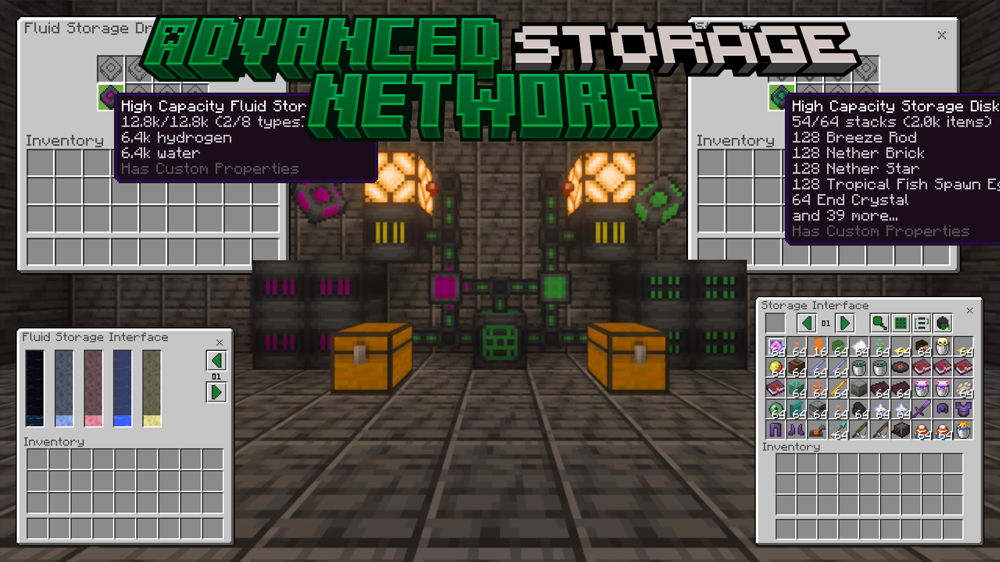

Advanced Storage Network finally fixes your storage problem.

One network holds every item you own, and you reach all of it through a single screen. Browse it, search it, and craft out of it without ever opening a chest.

## Features

- **Store anything.** Any item and any fluid can go on the network, including ones from other add-ons, and it grows as far as you build it.
- **Custom UI for the whole network.**
- **Automate it.** Devices to move items in and out on their own, keep an item in stock, and drive redstone off what's stored.
- **Reach it from anywhere.** Wireless access to a network, and relays that join its distant parts across any distance and any dimension.
- **Compatible with other Bedrock Energistics Core add-ons.** Any Core add-on can power the network or pipe fluids into it.

## Requirements

- Minecraft: Bedrock Edition v26.30 or later.
- [Bedrock Energistics Core](https://github.com/Fluffyalien1422/bedrock-energistics-core) v0.12.0.

## Version Support

| Version       | Support         |
| ------------- | --------------- |
| v3            | Full support.   |
| v2            | Bug fixes only. |
| Older than v2 | Not supported.  |

## Getting Started

You get the Advanced Storage Network Tutorial Book the first time you spawn into a world, and can craft another from a book and an emerald. **Hold it and interact to view all entries, or interact with a device to open that device's entry**, which gives you what the device does and what it needs. You can also view the tutorial book [online](https://fluffyalien1422.github.io/asn/).

This add-on adds no generators, so power your network from another Bedrock Energistics Core add-on such as [Bedrock Energistics](https://github.com/Fluffyalien1422/bedrock-energistics), or run `/asnrule useEnergy false` to play without energy.

## Configuration

Add-on rules can be changed in-game. These commands need operator permissions:

- `/asnrule help` — list every rule and what it does.
- `/asnrule <rule>` — read a rule's current value.
- `/asnrule <rule> <value>` — set a rule. Numbers must be quoted, for example `"123"` rather than `123`.
- `/asnrulereset <rule>` or `/asnrulereset all` — put rules back to their defaults.

For anything the commands don't cover, edit `scripts/__config.js` in the behavior pack with any text editor. It sets the default value of every rule and can lock a rule so players can't change it in-game, and it holds the options that aren't rules, such as whether new players are given the Tutorial Book.

Every option is optional and is documented with a comment in the file. Remove an option to use its default. If an option is missing or set to the wrong type, its default is used and a warning is logged to the content log.

## Bundling With Other Add-Ons

**Crafting.** Every recipe the network can craft is listed in `BP/scripts/generated/__recipes.js`, which by default covers vanilla and ASN recipes only. To let the network craft another add-on's items, regenerate that file with the recipe generator in this repository, passing it the extra recipes:

```sh
node scripts/recipegen.ts <vanilla recipes> <asn recipes> [additional recipes]
```

**Commands.** One add-on cannot have multiple custom command namespaces, so if ASN is merged into a single add-on with other content that has its own commands, set `customCommandNamespace` in `scripts/__config.js` to that add-on's namespace. The commands are then reached through it, as in `/<namespace>:asnrule`.

## Links

- [Online tutorial book](https://fluffyalien1422.github.io/asn/)
- [CurseForge](https://www.curseforge.com/minecraft-bedrock/addons/advanced-storage-network-2)
- [MCPEDL](https://mcpedl.com/advanced-storage-network-2/)
- [Releases and changelogs](https://github.com/Fluffyalien1422/asn/releases)
- [Bedrock Energistics Core](https://github.com/Fluffyalien1422/bedrock-energistics-core)
- [Vatonage Discord](https://discord.gg/vQuFe77)

## Contributing

**This repository does not accept third-party pull requests.** [Issues](https://github.com/Fluffyalien1422/asn/issues/new/choose) are welcome for bug reports, feature requests, and other feedback. Thanks for your understanding. For questions or help, ask in the [Vatonage Discord](https://discord.gg/vQuFe77).

## License

This project is licensed under the [ISC License](LICENSE).
